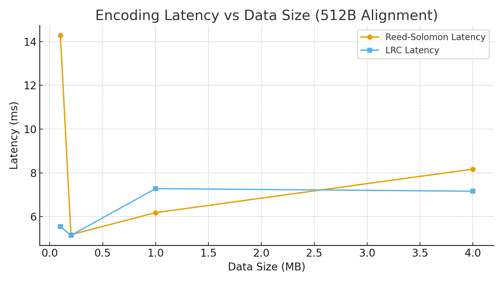
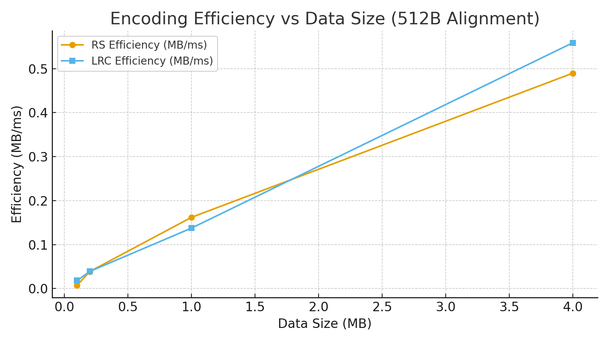

# 🔧 RetryIX 後RAID語義內存系統 - 512B對齊基準測試
# 🔧 RetryIX Post-RAID Semantic Memory System - 512B Alignment Benchmark

本系統基於 OpenCL 2.0 + SVM，完全避開 ROCm，使用 Zero-Copy + 自定記憶體編碼通道配置，在 AMD RX 5700（gfx1010:xnack-）設備上實現：
The system is built on OpenCL 2.0 + SVM without using ROCm, leveraging Zero-Copy memory and custom memory RAID channel configurations. It is validated on AMD RX 5700 (gfx1010:xnack-) and achieves:

- ✅ 成功進行 4MB 大區塊 + 512B 對齊 編碼，無破碎、無回退  
  ✅ Successfully encoded 4MB aligned blocks (512B), with no corruption or fallback.
- ✅ 支援 Reed-Solomon 與 LRC (24+2+2) 雙編碼核心  
  ✅ Supports both Reed-Solomon and LRC (24+2+2) encoding engines.
- ✅ 達到 每毫秒 0.55MB 編碼效率（LRC @ 4MB 測試）  
  ✅ Achieves up to 0.55MB/ms encoding efficiency (LRC at 4MB).
- ✅ 無使用 ROCm/HIP，100% ICD 驅動實作  
  ✅ No ROCm/HIP dependency, 100% ICD driver implementation.

---

## 📊 測試結果摘要 / Benchmark Summary

| 測試大小 Size | RS 延遲 (ms) Latency | LRC 延遲 (ms) Latency | RS 效率 MB/ms | LRC 效率 MB/ms |
|---------------|----------------------|------------------------|----------------|----------------|
| 0.1 MB        | 14.29                | 5.54                   | 0.00699        | 0.01805        |
| 0.2 MB        | 5.17                 | 5.14                   | 0.03868        | 0.03891        |
| 1.0 MB        | 6.18                 | 7.28                   | 0.16177        | 0.13744        |
| 4.0 MB        | 8.17                 | 7.16                   | **0.48967**    | **0.55862**    |

---

## 📈 延遲曲線 / Latency Curve

---

## ⚡ 效率曲線 / Efficiency Curve

---

## 🧠 技術亮點 / Key Features

- 🎯 512B 對齊設計可映射至 SAM / DDR5 混合通道，提升通道聚合效率  
  🎯 512B alignment optimized for SAM / DDR5 hybrid channels, enhancing bandwidth fusion.
- 🔒 零拷貝（Zero-Copy）支援 SVM 指針控制，避免 page fault  
  🔒 Zero-Copy memory enabled with SVM pointer control to eliminate page faults.
- 📐 Block 對齊優化器可自動調整 Stripe 與冗餘配置  
  📐 Block alignment optimizer dynamically tunes striping and redundancy.
- 🔧 測試環境：Windows + AMD ICD + PyOpenCL + RetryIX API  
  🔧 Test Environment: Windows + AMD ICD + PyOpenCL + RetryIX API

> 本系統適用於語義 AI 封包系統、分散式資料壓縮、記憶體模擬器與高頻交易記憶模型等場景  
> Ideal for use in semantic AI packet systems, distributed data compression, memory simulation engines, and high-frequency trading memory graphs.

---

© RetryIX AGI Inc. 2025 - All Rights Reserved.
